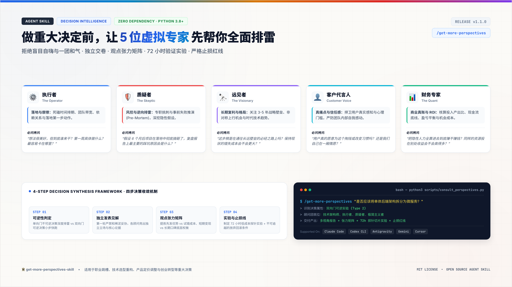

# 🏛️ get-more-perspectives-skill — 虚拟顾问团多视角决策洞察

> 在做出重大决定之前，召集 3-5 位拥有鲜明立场的虚拟专家顾问，从执行、风控、远见、用户体验和财务 5 个维度独立审视方案，帮你提前排雷、找准机会，交付带有低成本验证实验与止损红线的综合行动方案。

<p align="center">
  
</p>

---

## 🌟 为什么需要这个技能？

面对重大选择（如 Offer 抉择、技术架构重构、产品定价调整、业务转型等），决策者往往容易面临两种困境：
1. **一个人的思维盲区**：自己想方案容易陷入“证实偏见”，只看对自己有利的数据，忽视了致命隐患；
2. **团队内部的一团和气**：同事或朋友之间往往不好意思把话说明、不愿当面泼冷水，导致潜在风险被掩盖。

`get-more-perspectives-skill` 模拟由资深专家组成的**专属虚拟顾问团 (Advisory Board)**：
- ⚙️ **执行者 (The Operator)**：评估落地可行性、排期卡点与第一步具体动作
- 🛡️ **质疑者 (The Skeptic / 首席杠精)**：进行事前失败推演 (Pre-Mortem 逆向排雷)，死磕隐性假设与最坏情况
- 🔭 **远见者 (The Visionary)**：评估 3-5 年战略复利、非对称机会与时代技术趋势
- 👤 **客户代言人 (The Customer Voice)**：捍卫真实用户体验，区分是用户真痛点还是自己自嗨
- 📊 **财务专家 (The Quant)**：算清真实投入产出比 (ROI)、现金流底线与机会成本

各顾问先独立发表见解，随后通过**观点张力矩阵 (Tension Matrix)** 提炼本质权衡，输出附带 72 小时小步快跑实验与明确止损红线的决策建议。

---

## 🚀 快速开始与调用方式

### 1. Slash 快捷指令
```bash
# 通用决策分析
/get-more-perspectives 收到两份 Offer：外企架构师 vs AI 初创团队早期成员，怎么选？

# 指定垂直领域配方 (career, tech, pricing, startup)
/get-more-perspectives --domain tech 是否应该将单体后端架构拆分为微服务？

# 指定专属顾问席位
/get-more-perspectives --advisors operator,skeptic,visionary,quant 评估新季度产品定价策略
```

### 2. 自然语言触发
- *“在选项 A 与选项 B 之间犹豫不决，帮我多角度分析一下”*
- *“如果由不同维度的专家来评估这个决定，他们会怎么挑刺？”*
- *“帮我找出这个方案的致命盲点，并做个事前失败推演 (Pre-Mortem)”*

---

## 📦 跨平台安装指南 (Cross-Platform Installation)

本技能完全兼容 **Agent Skills 开放标准 (`SKILL.md`)**，可在 10+ 常见 Agent 与 IDE 环境中一键使用：

### 自动安装 (推荐)
```bash
git clone https://github.com/your-username/get-more-perspectives-skill.git
cd get-more-perspectives-skill
./install.sh
```

### 各平台支持：
- **Claude Code**: `/plugin marketplace add path/to/get-more-perspectives-skill`
- **OpenAI Codex CLI / Antigravity / Gemini CLI**: 安装至 `~/.agents/skills/get-more-perspectives-skill`
- **Cursor / Windsurf**: 运行 `./install.sh` 自动生成对应的 `.cursor/rules` 配置

---

## 🛠️ 内置 CLI 命令行工具

本技能内置开箱即用的 Python CLI 工具（Python 3.8+ 标准库，**零第三方依赖**）：

```bash
# 1. 查看所有可用顾问角色库
python3 scripts/consult_perspectives.py --list-advisors

# 2. 对特定决策议题生成多视角分析报告
python3 scripts/consult_perspectives.py --topic "是否应该辞职全职做独立开发？"

# 3. 指定垂直领域与输出文件路径
python3 scripts/consult_perspectives.py --domain tech --topic "将单体应用重构为微服务" --output report.md

# 4. 输出标准结构化 JSON 格式
python3 scripts/consult_perspectives.py --topic "新产品商业化方案" --format json

# 5. 执行自动化回归测试基准
python3 scripts/run_evals.py
```

---

## 📂 目录结构与模块说明

```
get-more-perspectives-skill/
├── SKILL.md                          # 核心技能定义与标准工作流规范
├── AGENTS.md                         # 跨平台 Agent 工具调用规则
├── README.md                         # 项目使用与实战说明
├── install.sh                        # 跨平台一键安装脚本
├── .claude-plugin/                   # Claude Code 插件元数据
├── scripts/
│   ├── consult_perspectives.py       # 顾问团多视角编排核心引擎 (Zero-Dependency)
│   ├── run_pipeline.py               # 单入口流水线执行器
│   ├── run_evals.py                  # 自动化回归测试与基准评测工具
│   ├── evolve.py                     # 经验与偏误沉淀工具
│   └── check_pipeline.py             # 流水线完整性校验脚本
├── references/
│   ├── advisor-personas.md           # 10+ 位专家的详细人设画像、思考视角与必问清单
│   ├── synthesis-frameworks.md       # 单向门/双向门分类、张力矩阵与事前失败推演方法论
│   └── domain-recipes.md             # 职场、技术、定价、创业等 4 大高频场景决策配方
├── assets/
│   ├── advisor-personas.json         # 机器可读的顾问角色数据库
│   ├── perspectives-template.md      # 标准多视角输出 Markdown 模版
│   └── decision-matrix-schema.json   # 决策综合输出 JSON Schema
└── evals/
    ├── get-more-perspectives-skill.eval.md  # 评测规范文件
    └── golden/                             # 黄金基准测试用例集
```

---

## 💡 实战决策四大原则

1. **单向门与双向门区别对待**：可逆决策（双向门）不做无谓争论，用 72 小时低成本实验拿真实数据；不可逆决策（单向门）必须深度排雷、做事前失败推演。
2. **第一轮坚决独立交卷**：顾问发言严禁提前互相附和，质疑者必须足够尖锐，远见者必须敢于看到长远机会。
3. **把争论提炼为本质权衡**：不搞“各打五十大板”的和稀泥，清晰梳理“先发优势 vs 试错成本”、“短期变现 vs 长期口碑”等底层权衡。
4. **提前设立止损红线 (Kill Criteria)**：在行动第一天写清撤退条件，彻底避免陷入沉没成本陷阱。

---

## 📄 开源许可证
本项目基于 [MIT License](LICENSE) 开源。

